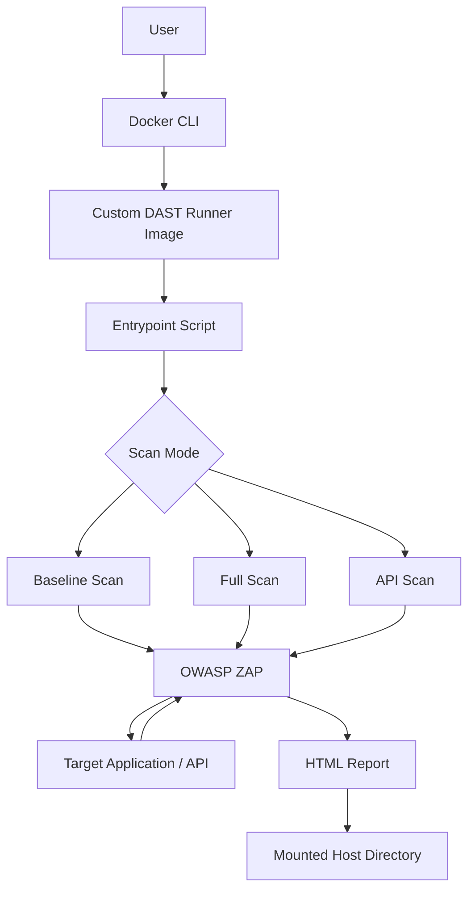

# 🛡️ Dockerized DAST Runner

### Automated Web Application & API Security Testing with Docker and OWASP ZAP

[](https://www.docker.com/)
[](https://www.zaproxy.org/)
[](https://www.gnu.org/software/bash/)
[](https://github.com/features/packages)
[](#-security--responsible-usage)

A reusable, containerized **Dynamic Application Security Testing (DAST)** runner powered by [OWASP ZAP](https://www.zaproxy.org/) and Docker.

This project packages OWASP ZAP into a custom Docker image with a parameterized entrypoint, allowing users to run automated security scans against web applications and APIs using a single Docker command.

No local ZAP installation, repository cloning, or custom environment setup is required to use the published image.

The runner supports baseline scans, full scans, and API scans, with HTML reports saved directly to the user's current working directory.

---

## 📑 Table of Contents

* [Overview](#-overview)
* [Features](#-features)
* [Architecture](#-architecture)
* [Scan Modes](#-scan-modes)
* [Prerequisites](#-prerequisites)
* [Quick Start](#-quick-start)
* [Usage](#-usage)
* [Configuration](#-configuration)
* [Installation and Local Build](#-installation-and-local-build)
* [Publishing to GHCR](#-publishing-to-github-container-registry)
* [Understanding Reports](#-understanding-reports)
* [CI/CD Integration](#-cicd-integration)
* [Troubleshooting](#-troubleshooting)
* [Security and Responsible Usage](#-security--responsible-usage)
* [Limitations](#-limitations)
* [Roadmap](#-roadmap)
* [Contributing](#-contributing)
* [License](#-license)

---

## 📌 Overview

Security testing is an important part of the software development lifecycle. However, setting up security tools, managing dependencies, and configuring scanning environments can introduce unnecessary complexity.

This project aims to simplify that process by packaging OWASP ZAP in a reusable Docker image.

Instead of installing ZAP and configuring it manually, users can execute a command like:

```powershell
docker run --rm `
  -v "${PWD}:/zap/wrk/:rw" `
  ghcr.io/adityaa2510/dast-runner:1.0.0 `
  --mode baseline `
  --target http://host.docker.internal:3000 `
  --report zap-report.html
```

The runner starts the requested scan, processes the target, and saves the generated report to the mounted directory.

### 🎯 Project Objectives

* Simplify DAST execution through Docker.
* Eliminate local OWASP ZAP installation requirements.
* Support multiple security scanning modes.
* Provide runtime configuration through command-line arguments.
* Generate portable HTML security reports.
* Enable reuse across different applications and environments.
* Provide a foundation for CI/CD security integration.

---

## 🚀 Features

| Feature              | Description                                                         |
| -------------------- | ------------------------------------------------------------------- |
| 🐳 Dockerized        | Runs OWASP ZAP in a containerized environment.                      |
| 🔍 Baseline Scan     | Performs passive security checks.                                   |
| ⚡ Full Scan          | Performs active security testing against authorized targets.        |
| 🔌 API Scan          | Scans APIs using an OpenAPI specification.                          |
| ⚙️ Parameterized     | Accepts scan mode, target, and report filename at runtime.          |
| 📂 Current Directory | Mounts the user's current working directory for report storage.     |
| 📊 HTML Reports      | Generates HTML reports for reviewing scan results.                  |
| 📦 GHCR              | Supports distribution through GitHub Container Registry.            |
| 🔁 Reusable          | Can be used against different authorized targets.                   |
| 🧩 Extensible        | Provides a foundation for CI/CD integration and further automation. |

---

## 🏗️ Architecture

The runner uses a custom Docker image built on top of the official OWASP ZAP image.



### Workflow

1. The user invokes the Docker image and supplies runtime arguments.
2. Docker mounts the user's current working directory into `/zap/wrk`.
3. The custom entrypoint parses the scan mode, target, and report filename.
4. The entrypoint selects the appropriate OWASP ZAP automation script.
5. OWASP ZAP performs the configured scan against the target.
6. The generated HTML report is written into the mounted directory.
7. The user can access the report directly from the host machine.

### Components

| Component          | Responsibility                                           |
| ------------------ | -------------------------------------------------------- |
| Docker             | Provides an isolated and portable execution environment. |
| OWASP ZAP          | Performs automated security testing.                     |
| Entrypoint Script  | Parses arguments and selects the scanning mode.          |
| Docker Volume      | Makes reports available on the host machine.             |
| GHCR               | Hosts the published Docker image.                        |
| Target Application | The authorized web application or API being assessed.    |

---

## 🔍 Scan Modes

The runner provides three scan modes.

### 1. Baseline Scan

The baseline scan uses passive security checks to identify potential vulnerabilities and security misconfigurations.

It does not intentionally perform active attack testing against the target.

**Typical use cases:**

* Initial security checks
* Development environments
* Regular security assessments
* CI/CD workflows where low-impact checks are preferred

**Command:**

```powershell
docker run --rm `
  -v "${PWD}:/zap/wrk/:rw" `
  ghcr.io/adityaa2510/dast-runner:1.0.0 `
  --mode baseline `
  --target http://host.docker.internal:3000 `
  --report baseline-report.html
```

**Underlying ZAP command:**

```bash
zap-baseline.py -t TARGET -r REPORT
```

### 2. Full Scan

The full scan combines passive checks with active security testing.

Active scanning sends test payloads to the application and may affect application behavior, generate test data, or modify records.

**Typical use cases:**

* Authorized penetration testing in controlled environments
* Testing deliberately vulnerable applications
* Deeper security assessments of staging environments

**Command:**

```powershell
docker run --rm `
  -v "${PWD}:/zap/wrk/:rw" `
  ghcr.io/adityaa2510/dast-runner:1.0.0 `
  --mode full `
  --target http://host.docker.internal:3000 `
  --report full-report.html
```

**Underlying ZAP command:**

```bash
zap-full-scan.py -t TARGET -r REPORT
```

> ⚠️ **Warning:** Active scans should only be performed against systems you own or have explicit authorization to test. Use a disposable or isolated test environment wherever possible.

### 3. API Scan

The API scan is designed for APIs described by an OpenAPI specification.

The specification must be available inside the mounted directory so that the container can access it.

**Example directory:**

```text
api-project/
├── openapi.yaml
└── other-files/
```

**Command:**

```powershell
docker run --rm `
  -v "${PWD}:/zap/wrk/:rw" `
  ghcr.io/adityaa2510/dast-runner:1.0.0 `
  --mode api `
  --target /zap/wrk/openapi.yaml `
  --report api-report.html
```

**Underlying ZAP command:**

```bash
zap-api-scan.py -t /zap/wrk/openapi.yaml -f openapi -r api-report.html
```

The API scan uses the OpenAPI specification to identify API endpoints and test them. Confirm the input format and supported options against the ZAP version used by the image.

---

## 🧰 Prerequisites

### Required

* Docker Desktop for Windows or Docker Engine for Linux.
* A running web application or a supported API specification.
* Network connectivity from the Docker container to the target.
* Authorization to perform security testing against the target.

### Verify Docker

```powershell
docker --version
docker info
```

For Linux:

```bash
docker --version
docker info
```

---

## ⚡ Quick Start

The quickest way to use the published image is to pull it from GitHub Container Registry.

### Step 1: Pull the image

```powershell
docker pull ghcr.io/adityaa2510/dast-runner:1.0.0
```

### Step 2: Start your target application

For example, start OWASP Juice Shop:

```powershell
docker run -d `
  --name juice-shop `
  -p 3000:3000 `
  bkimminich/juice-shop
```

Confirm that the application is accessible on your host at:

```text
http://localhost:3000
```

### Step 3: Run a baseline scan

Open PowerShell in the directory where you want to save the report:

```powershell
docker run --rm `
  -v "${PWD}:/zap/wrk/:rw" `
  ghcr.io/adityaa2510/dast-runner:1.0.0 `
  --mode baseline `
  --target http://host.docker.internal:3000 `
  --report zap-report.html
```

### Step 4: View the report

After the scan completes, the report should be available in your current directory:

```text
zap-report.html
```

Open it in your browser to review the findings.

> The image must be published and accessible in GHCR for these pull commands to work. If the package is private, authenticate with Docker first.

---

## 💻 Usage

### Windows PowerShell

The `${PWD}` variable resolves to the current PowerShell working directory.

**Baseline scan:**

```powershell
docker run --rm `
  -v "${PWD}:/zap/wrk/:rw" `
  ghcr.io/adityaa2510/dast-runner:1.0.0 `
  --mode baseline `
  --target http://host.docker.internal:3000 `
  --report baseline.html
```

**Full scan:**

```powershell
docker run --rm `
  -v "${PWD}:/zap/wrk/:rw" `
  ghcr.io/adityaa2510/dast-runner:1.0.0 `
  --mode full `
  --target http://host.docker.internal:3000 `
  --report full.html
```

**API scan:**

```powershell
docker run --rm `
  -v "${PWD}:/zap/wrk/:rw" `
  ghcr.io/adityaa2510/dast-runner:1.0.0 `
  --mode api `
  --target /zap/wrk/openapi.yaml `
  --report api.html
```

### Linux and macOS

The `$(pwd)` command resolves the current working directory.

**Baseline scan:**

```bash
docker run --rm \
  -v "$(pwd):/zap/wrk/:rw" \
  ghcr.io/adityaa2510/dast-runner:1.0.0 \
  --mode baseline \
  --target http://host.docker.internal:3000 \
  --report baseline.html
```

On Linux, if `host.docker.internal` is not available, add:

```bash
--add-host=host.docker.internal:host-gateway
```

For example:

```bash
docker run --rm \
  --add-host=host.docker.internal:host-gateway \
  -v "$(pwd):/zap/wrk/:rw" \
  ghcr.io/adityaa2510/dast-runner:1.0.0 \
  --mode baseline \
  --target http://host.docker.internal:3000 \
  --report baseline.html
```

---

## ⚙️ Configuration

The runner accepts command-line arguments to configure a scan at runtime.

| Argument   | Required | Description                             | Example                            |
| ---------- | -------- | --------------------------------------- | ---------------------------------- |
| `--mode`   | Yes      | Selects the scan type                   | `baseline`                         |
| `--target` | Yes      | URL or supported API specification path | `http://host.docker.internal:3000` |
| `--report` | No       | HTML report filename                    | `zap-report.html`                  |
| `--help`   | No       | Displays usage instructions             | `--help`                           |

### `--mode`

Supported values:

* `baseline`
* `full`
* `api`

### `--target`

For web scans, provide the URL of the application that the container can reach.

Example:

```text
http://host.docker.internal:3000
```

For API scans, provide a path to a supported OpenAPI specification inside `/zap/wrk`.

Example:

```text
/zap/wrk/openapi.yaml
```

### `--report`

The report name must be a filename, not a path. Reports are written inside `/zap/wrk`, which is mapped to the host directory.

Example:

```text
zap-report.html
```

### `--help`

Display usage instructions:

```powershell
docker run --rm ghcr.io/adityaa2510/dast-runner:1.0.0 --help
```

---

## 🛠️ Installation and Local Build

If you want to modify the entrypoint or build your own version, clone the repository.

### Step 1: Clone the repository

```bash
git clone https://github.com/Adityaa2510/dast-runner.git
cd dast-runner
```

### Step 2: Review the project structure

```text
dast-runner/
├── Dockerfile
├── dast-entrypoint.sh
├── .dockerignore
└── README.md
```

### Step 3: Build the image

```bash
docker build -t dast-runner:1.0.0 .
```

### Step 4: Verify the image

```bash
docker images
```

### Step 5: Run the locally built image

```powershell
docker run --rm `
  -v "${PWD}:/zap/wrk/:rw" `
  dast-runner:1.0.0 `
  --mode baseline `
  --target http://host.docker.internal:3000 `
  --report local-report.html
```

---

## 📦 Publishing to GitHub Container Registry

The image can be published to GitHub Container Registry (GHCR) so other users can pull and run it.

### Step 1: Create a GitHub Personal Access Token

Create a classic Personal Access Token in your GitHub settings with the required package permissions, including:

* `write:packages`
* `read:packages`

Only grant additional permissions if needed. If your account or organization requires SSO authorization, authorize the token as applicable.

### Step 2: Authenticate

In PowerShell:

```powershell
$env:GHCR_TOKEN = Read-Host "Enter your GitHub token"
$env:GHCR_TOKEN | docker login ghcr.io -u adityaa2510 --password-stdin
Remove-Item Env:GHCR_TOKEN
```

### Step 3: Build and tag

```powershell
docker build -t ghcr.io/adityaa2510/dast-runner:1.0.0 .
```

### Step 4: Push the image

```powershell
docker push ghcr.io/adityaa2510/dast-runner:1.0.0
```

### Step 5: Add the latest tag

```powershell
docker tag `
  ghcr.io/adityaa2510/dast-runner:1.0.0 `
  ghcr.io/adityaa2510/dast-runner:latest
```

```powershell
docker push ghcr.io/adityaa2510/dast-runner:latest
```

### Step 6: Configure package visibility

In GitHub, navigate to your profile's **Packages** section, select `dast-runner`, and open **Package settings**.

If you want anyone to pull the image without authentication, set its visibility to public.

Never commit access tokens to your repository.

---

## 📊 Understanding Reports

OWASP ZAP generates an HTML report containing detected alerts and relevant evidence.

A report may include:

| Field       | Description                                              |
| ----------- | -------------------------------------------------------- |
| Alert       | The security issue or configuration concern identified   |
| Risk        | ZAP's assigned risk category                             |
| Confidence  | How confident ZAP is in the finding                      |
| URL         | The affected endpoint                                    |
| Parameter   | The parameter associated with the finding, if applicable |
| Description | Explanation of the finding                               |
| Solution    | Suggested remediation guidance                           |
| Evidence    | Supporting details from the scan, where available        |
| Reference   | Further documentation or security guidance               |

### Risk categories

| Risk          | General meaning                                          |
| ------------- | -------------------------------------------------------- |
| High          | A finding that may have substantial security impact      |
| Medium        | A finding that may present a meaningful security concern |
| Low           | A lower-impact issue or security weakness                |
| Informational | Additional information that may help with assessment     |

Risk ratings are tool-assigned indicators, not a complete measure of application risk. Validate findings in context and investigate false positives or issues requiring manual verification.

### Example baseline scan results

An initial baseline scan of OWASP Juice Shop in this project produced the following results:

| Category           | Count |
| ------------------ | ----: |
| High               |     0 |
| Medium             |     2 |
| Low                |     5 |
| Informational      |     4 |
| Endpoints assessed |    65 |

Examples of reported findings included:

* Missing Content Security Policy (CSP) header
* Cross-domain misconfiguration
* Missing or invalid COEP and COOP headers
* Dangerous JavaScript functions
* Deprecated Feature Policy header
* Unix timestamp disclosure

These results represent one baseline scan in a specific test environment. They do not establish that the application is secure or that no other vulnerabilities exist.

Before sharing reports publicly, remove any sensitive information such as internal hostnames, tokens, session identifiers, or user data.

---

## 🔄 CI/CD Integration

A potential extension of the runner is to integrate DAST scans into CI/CD workflows using GitHub Actions.

For example, a workflow can:

1. Build and deploy a test application.
2. Wait for the application to become available.
3. Run the DAST runner against the test environment.
4. Store the generated report as a workflow artifact.
5. Apply team-defined policies to decide whether a build should continue.

### Example GitHub Actions workflow

The following is an illustrative workflow for a test application that is already deployed and reachable by the runner:

```yaml
name: DAST Security Scan

on:
  workflow_dispatch:

jobs:
  dast:
    runs-on: ubuntu-latest

    steps:
      - name: Checkout repository
        uses: actions/checkout@v4

      - name: Run OWASP ZAP baseline scan
        run: |
          mkdir -p reports

          docker run --rm \
            -v "${{ github.workspace }}/reports:/zap/wrk/:rw" \
            ghcr.io/adityaa2510/dast-runner:1.0.0 \
            --mode baseline \
            --target "${{ vars.DAST_TARGET }}" \
            --report zap-report.html

      - name: Upload DAST report
        if: always()
        uses: actions/upload-artifact@v4
        with:
          name: zap-dast-report
          path: reports/zap-report.html
          if-no-files-found: warn
```

Configure `DAST_TARGET` as a repository variable containing the URL of an authorized test environment.

This example assumes the target is already accessible from the GitHub-hosted runner. It does not deploy the application, configure authentication, or define a vulnerability-based build gate. Those steps must be added for the particular CI/CD environment.

---

## 🐛 Troubleshooting

### 1. Permission denied while pushing to GHCR

**Error:**

```text
permission_denied: The token provided does not match expected scopes
```

**Possible causes:**

* The token lacks `write:packages`.
* Docker is using older credentials.
* The token is not authorized for the organization or package.

**Resolution:**

```powershell
docker logout ghcr.io
```

Log in again using a valid token with the necessary permissions, then retry the push.

### 2. Target is unreachable

**Possible error:**

```text
Connection refused
```

**Possible causes:**

* The target application is not running.
* The port is incorrect.
* The container cannot reach the host or target network.

**Resolution:**

Check that the application is running and listening on the expected port. For a host application on port `3000`, use:

```text
http://host.docker.internal:3000
```

On Linux, you may need:

```bash
--add-host=host.docker.internal:host-gateway
```

### 3. Report not found on the host

**Possible causes:**

* The current directory was not mounted correctly.
* The container could not write to the mounted directory.
* The scan did not generate the expected report.

**Resolution:**

Verify that the volume argument is correct:

```powershell
-v "${PWD}:/zap/wrk/:rw"
```

Check the container output and exit code to determine whether the scan completed and produced a report.

### 4. Invalid scan mode

**Error:**

```text
Error: --mode must be baseline, full, or api
```

**Resolution:**

Use one of the supported values:

```text
baseline
full
api
```

### 5. API specification not found

**Possible error:**

```text
Error: API specification not found
```

**Resolution:**

Ensure the specification exists in the current host directory and use its container path, for example:

```text
/zap/wrk/openapi.yaml
```

### 6. ZAP returns a non-zero exit code

ZAP may return a non-zero exit status when alerts meet configured thresholds or when a scan encounters an error.

Review the scan output and HTML report to determine whether the scan completed and whether the exit status indicates findings, configuration problems, or execution failure.

---

## 🔐 Security & Responsible Usage

This project is intended for authorized security testing, educational use, and controlled security assessments.

* Only scan applications you own or have explicit permission to assess.
* Use full scans only in controlled environments.
* Avoid scanning production applications unless you have specific authorization and an approved testing plan.
* Use disposable test data and isolated environments when running active scans.
* Protect generated reports because they may contain sensitive application details.
* Avoid including secrets, credentials, or private customer information in reports or repository commits.
* Validate findings before treating them as confirmed vulnerabilities.

**A baseline scan is not a full penetration test, and the absence of high-risk alerts does not guarantee that an application is secure.**

---

## ⚠️ Limitations

* Baseline scans primarily identify issues detectable through passive checks.
* Full scans can affect application behavior and require careful authorization and scope control.
* API scans depend on a supported and sufficiently complete API specification.
* Findings may require manual verification and can include false positives.
* Authentication-dependent routes may not be fully assessed without additional configuration.
* Scans can miss business logic flaws and other vulnerabilities that require manual testing.
* Network access, firewall rules, and host configuration can affect scan coverage.
* The current runner exposes only a basic set of runtime parameters; advanced ZAP configuration may require extending the entrypoint.

---

## 🗺️ Roadmap

Potential future enhancements include:

* [ ] GitHub Actions integration with automated report artifacts
* [ ] Configurable scan policies and alert thresholds
* [ ] Support for authenticated scanning
* [ ] JSON and XML report formats
* [ ] Automated report parsing and summarization
* [ ] Custom rules and exclusion configuration
* [ ] Scheduled DAST scans
* [ ] Notifications for scan results
* [ ] Version-pinned releases and automated image publishing
* [ ] Security gates based on configurable policies

These are planned enhancements and are not necessarily implemented in the current version.

---

## 🤝 Contributing

Contributions, bug reports, feature suggestions, and documentation improvements are welcome.

1. Fork the repository.
2. Create a feature branch.
3. Make your changes.
4. Test the runner against an authorized test application.
5. Submit a pull request describing your changes.

For security-related issues, avoid publicly disclosing exploitable details about systems you do not own. Use an appropriate private reporting channel.

---

## 📜 License

Add a `LICENSE` file to the repository to specify the terms under which the project can be used, modified, and distributed.

OWASP ZAP and other included software remain subject to their respective licenses. Review those licenses before redistributing a derived image.

---

## 👨‍💻 Author

**Aditya Patro**

GitHub: [Adityaa2510](https://github.com/Adityaa2510)

Project Repository: [Dockerized DAST Runner](https://github.com/Adityaa2510/dast-runner)

---

## ⭐ Support

If you find this project useful for learning, testing, or security automation, consider starring the repository and sharing feedback.

**Built to make automated security testing more portable, repeatable, and accessible.**

*Part of my ongoing journey into DevSecOps, application security, and security automation.*
